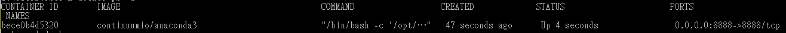
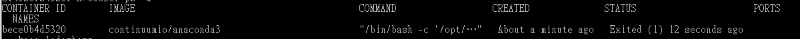
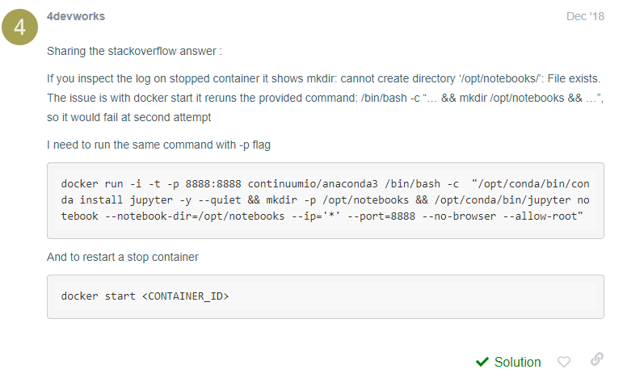

# Anaconda container fail to restart problem solve
發現重新開機之後，我想要再重新 start 容器，發現要再次啟動時，都會無法順利啟動

上網搜尋了一下原因，發現了以下的辦法

使用之後，即可順利重新啟動 container

reference: [https://forums.docker.com/t/how-to-re-run-the-continumio-anaconda3-docker-container/65713]